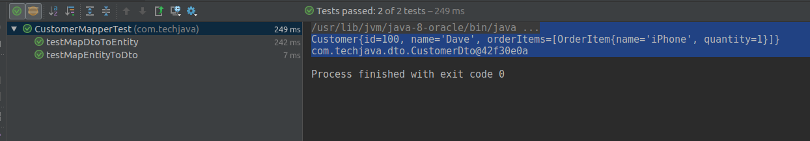

# mapstruct-demo
This project explains how automatically do java mapping using mapstruct API

### What is MapStruct

MapStruct is a code generator that greatly simplifies the implementation of mappings between Java bean types based on a convention over configuration approach.
The generated mapping code uses plain method invocations and thus is fast, type-safe and easy to understand.
MapStruct solves some traditional mapping issues like a lack of performance, difficult mapping code debugging and late errors détection.

### Maven Configuration

```
<properties>
        <org.mapstruct.version>1.2.0.Final</org.mapstruct.version>
    </properties>

    <dependencies>
        <dependency>
            <groupId>org.mapstruct</groupId>
            <artifactId>mapstruct-jdk8</artifactId>
            <version>${org.mapstruct.version}</version>
        </dependency>

        <dependency>
            <groupId>org.mapstruct</groupId>
            <artifactId>mapstruct-processor</artifactId>
            <version>${org.mapstruct.version}</version>
            <!-- IntelliJ does not pick up the processor if it is not in the dependencies.
             There is already an open issue for IntelliJ see https://youtrack.jetbrains.com/issue/IDEA-150621
            -->
            <scope>provided</scope>
        </dependency>

        <dependency>
            <groupId>junit</groupId>
            <artifactId>junit</artifactId>
            <version>4.12</version>
            <scope>test</scope>
        </dependency>

        <dependency>
            <groupId>org.assertj</groupId>
            <artifactId>assertj-core</artifactId>
            <version>3.6.2</version>
            <scope>test</scope>
        </dependency>

    </dependencies>

    <build>
        <plugins>
            <plugin>
                <groupId>org.apache.maven.plugins</groupId>
                <artifactId>maven-compiler-plugin</artifactId>
                <version>3.6.2</version>
                <configuration>
                    <source>1.8</source>
                    <target>1.8</target>
                    <annotationProcessorPaths>
                        <path>
                            <groupId>org.mapstruct</groupId>
                            <artifactId>mapstruct-processor</artifactId>
                            <version>${org.mapstruct.version}</version>
                        </path>
                    </annotationProcessorPaths>
                </configuration>
            </plugin>
        </plugins>
	</build>

```

### Source code

* created customer and orderitem pojo classes

```
public class Customer {

    private Long id;
    private String name;
    private Collection<OrderItem> orderItems;
	//Add Getters and Setters
}

public class OrderItem {

    private String name;
    private Long quantity;
	//Add Getters and Setters
}

```
* created customerdto and orderitemdto classes

```
public class CustomerDto {

    public Long id;
    public String customerName;
    public List<OrderItemDto> orders;
}

public class OrderItemDto {

    public String name;
    public Long quantity;
}

```

* created mapper class for mapping map customer and customerdto and OrderItem and OrderItemDto

#### Key points to remember:

@Mapper
@Mappings
@InheritInverseConfiguration

```
@Mapper(uses = {OrderItemMapper.class})
public interface CustomerMapper {

    CustomerMapper MAPPER = Mappers.getMapper(CustomerMapper.class);

    @Mappings({
            @Mapping(source = "orders", target = "orderItems"),
            @Mapping(source = "customerName", target = "name")
    })
    Customer toCustomer(CustomerDto customerDto);

    @InheritInverseConfiguration
    CustomerDto fromCustomer(Customer customer);
}

```

### Output




 